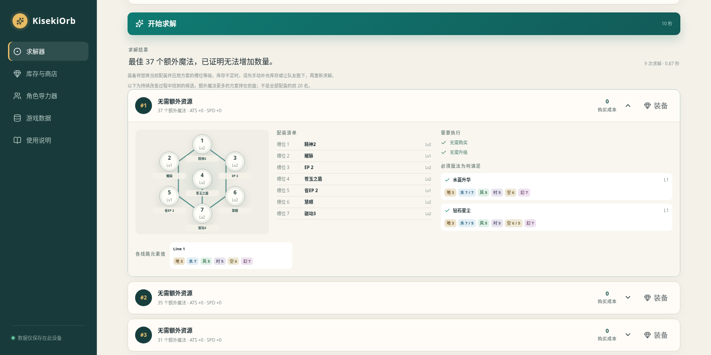
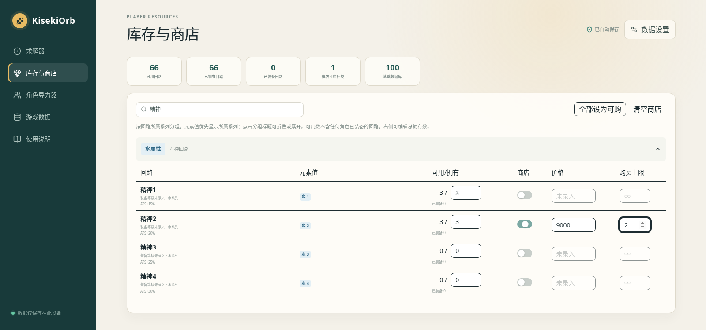
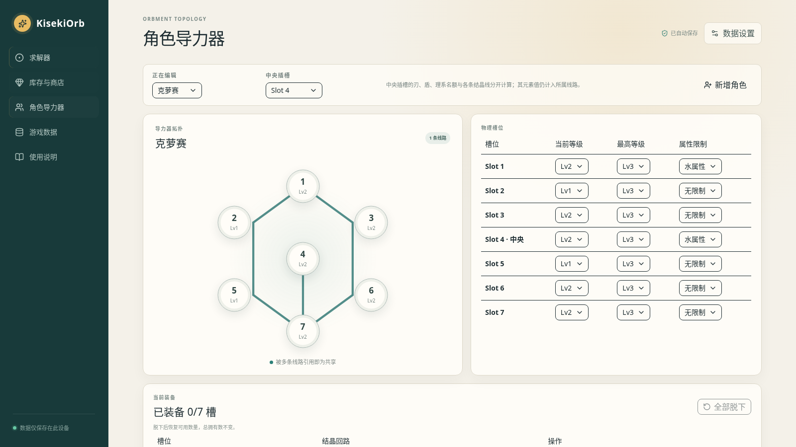
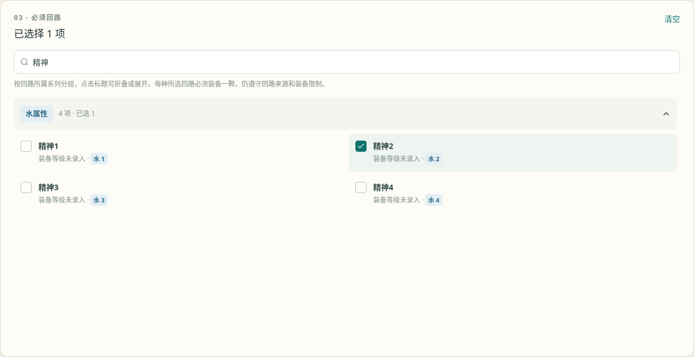
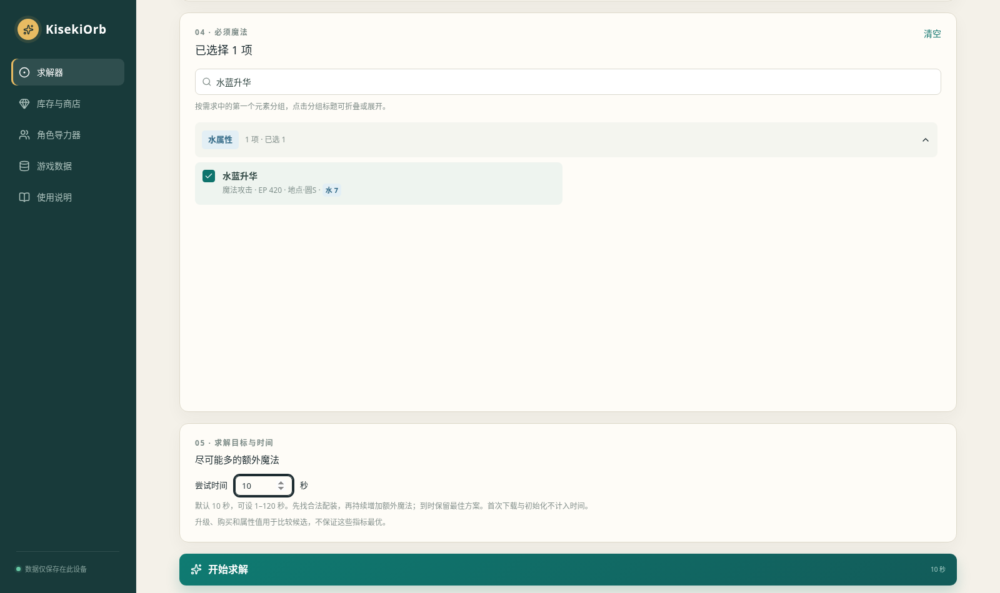
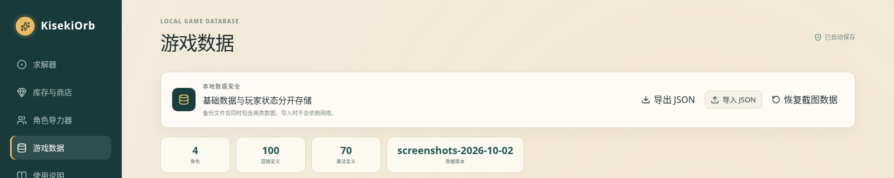

# KisekiOrb

《空之轨迹 the 2nd》本地导力器（Orbment）与魔法（Arts）约束求解器。

## 在线体验

<https://maodlife.github.io/KisekiOrb/>



## 使用说明

第一次使用建议按 **设置库存 → 确认角色与槽位 → 选择约束 → 求解与装备 → 备份数据** 的顺序操作。**网页左侧也有「使用说明」**，提供完整步骤、实测配图、常见问题，以及跳转到对应操作页面的按钮。

### 1. 设置库存与商店

打开「库存与商店」，按元素系列展开分组或搜索回路。把「可用/拥有」右侧的数字改成实际总拥有数，包含所有角色已装备的回路；左侧可用数会自动扣除全部已装备数量。

如需规划购买，打开回路的「商店」开关，填写价格与购买上限。上限留空表示不限购，价格未知时可留空，但不能据此得到准确的总购买费用。**初始库存来自内置游戏截图，请先改成自己的库存；默认所有回路不可购买。** 修改会自动保存。



### 2. 确认角色与槽位

打开「角色导力器」，选择要配装的角色，并将各槽位的「当前等级」设成游戏中的实际等级。内置角色已有线路和属性限制；需要修正或新增角色时，也可编辑最高等级、属性限制、中央插槽和线路成员。

返回「求解器」，选择同一角色，点击导力器图中的槽位，分别设置「允许升级」和最高等级。未允许升级时，该槽位只使用当前等级。切换角色或重新载入页面后，请重新确认升级策略。



### 3. 选择求解约束

在「求解器」中按顺序设置：

| 选择区 | 如何使用 |
| --- | --- |
| 02 · 回路来源 | 「只使用可用」排除队友装备，当前角色装备可复用；「只使用已拥有」按总库存规划；「已拥有 + 商店」允许规划购买已标记可购的回路。 |
| 03 · 必须回路 | 搜索并勾选想保留的回路。每项显示「可使用」数量（扣除队友装备，当前角色装备可复用）与「当前库存」（总拥有数）。每个选中的种类都必须装备一颗，槽位由求解器安排。 |
| 04 · 必须魔法 | 搜索或展开分组，勾选希望获得的魔法；每个目标都必须满足。 |
| 05 · 求解目标与时间 | 目标为「尽可能多的额外魔法」，尝试时间可设 1–120 秒的整数，默认 10 秒。 |

必须回路、必须魔法可以只选一种，也可以同时选择；**至少选择一项**才能开始求解。可先点各选择区的「清空」移除默认或已有目标。下图以「精神2」和「水蓝升华」为例。





### 4. 求解、查看与装备

点击「开始求解」，向下查看结果。首次需要加载约 35 MB 的求解器并初始化，这段时间不计入尝试时间；配装计算在浏览器中进行。求解器先寻找满足全部目标的方案，再持续增加额外魔法，到时或点击「取消」时保留已经找到的最佳方案。

展开候选方案，可以查看导力器图、配装清单、购买与升级步骤，以及必须魔法对应的线路元素值。点击「装备」会更新**网站中的**当前角色配装及槽位等级，再按清单到游戏中操作；装备占用可用库存，总拥有数不变。


商店方案不会自动购买；已拥有模式也可能使用队友装备的回路。实际装备始终检查当前可用库存，需先手动补充实际库存或让队友脱下，再重新求解。可在「角色导力器」中单独脱下或全部脱下。

候选按额外魔法数量排列，最多显示 20 个改善方案；费用、升级和 ATS/SPD 用于比较，不保证最优。提示“已证明无法增加数量”才表示额外魔法数量最优。「没有合法方案」表示当前约束已证明无解；「本次尝试未找到方案」可增加时间重试，并不代表无解。

### 5. 导出与导入数据

打开「游戏数据」，点击「导出 JSON」，保存下载的 `kiseki-orbment-backup.json`。备份包含游戏数据库、库存与商店、角色槽位等级、装备记录及求解偏好（角色、回路来源、必须回路、必须魔法、尝试时间）。候选结果和临时允许升级策略不会导出。

换设备、浏览器或域名时，打开目标站点的「游戏数据」，点击「导入 JSON」并选择备份。**导入会替换当前数据并自动保存，建议先导出当前数据。**



数据仅保存在当前浏览器、当前站点，无需账号，不会跨设备同步。清理浏览器数据、使用无痕窗口或更换域名时，请使用 JSON 备份迁移。「恢复截图数据」会重置本地数据库和玩家状态，使用前请先导出备份。

## 部署到 GitHub Pages

在仓库的 **Settings → Pages → Build and deployment → Source** 中选择 **GitHub Actions**。推送 `webapp/` 或部署工作流的更新到 `master` 后，GitHub Actions 自动校验、静态构建、用 Chromium 验证求解，再发布到 Pages。也可以在 Actions 中手动运行 `Deploy GitHub Pages`。

Pages 构建使用 `pnpm build:pages`，输出为 `webapp/dist/client/`，默认访问前缀为 `/KisekiOrb`。工作流从 Pages 设置读取路径和域名；现有 `pnpm dev`、`pnpm build` 继续使用 Sites / Cloudflare 配置。

Z3 的 Worker、官方加载脚本与已校验的 WASM 一起发布，不需要 `/api/z3/*` 后端。GitHub Pages 无法自定义 COOP / COEP 响应头，因此首次访问会注册同源 Service Worker，并自动刷新一次来启用 SharedArrayBuffer。需要支持 Service Worker 的现代浏览器和 HTTPS。玩家数据仍只保存在当前浏览器；从其它域名迁移时，使用 JSON 导出、导入。

静态托管的浏览器检查：先在 `webapp/` 执行 `pnpm build:pages`，安装 Python `playwright==1.58.0` 和 Chromium，再执行 `python scripts/test-pages.py`。检查使用没有隔离响应头的静态服务器，验证首次加载、子路径资源、真实 Z3 求解及本地状态保留。

## 本地部署

需要 Node.js 22+ 与 pnpm：

```bash
cd webapp
pnpm install
pnpm dev
```

打开终端中显示的 `http://localhost:3000/`。所有游戏数据与玩家状态均保存在当前浏览器的 `localStorage`，不需要账号。正式站点首次求解会下载约 35 MB 的官方 Z3 WebAssembly，游戏数据和求解计算仍留在浏览器中；本地开发直接加载已安装 npm 包中的 WASM。

## 校验

```bash
cd webapp
pnpm test
pnpm exec tsc --noEmit
pnpm build
node scripts/test-browser-worker.mjs
node --experimental-strip-types scripts/benchmark-z3.ts
```

## 游戏数据与配装规则

内置数据来自 `docs/game_screenshots/` 中的游戏截图，包括 4 名角色的导力器、100 个结晶回路与 70 个魔法。Web App 会直接读取以下 JSON：

- `webapp/data/characters.json`
- `webapp/data/quartz.json`
- `webapp/data/arts.json`
- `webapp/data/default-resources.json`

截图未显示的回路装备等级、唯一装备与显式互斥分组保留为 `null`；已确认的同名等级系列互斥与刃、盾、理线路限制由应用统一执行。默认库存取自截图“未装备/总数”中的总数；截图没有商店信息，因此默认全部标记为不可购买且价格未知。

这些数据仍可在「游戏数据」页面编辑，或通过 JSON 导入完整数据库。库存、商店状态和角色当前槽位等级与基础数据库分开存储。如果浏览器中已有旧示例或自定义数据，应用会优先保留本地数据；可在「游戏数据」页面点击「恢复截图数据」显式切换到本次生成的数据库。

回路的所属元素由 `series` 字段指定，与 `elements` 的键顺序及数值大小无关。「库存与商店」按此系列分组，并优先显示该系列的元素值。旧数据未填写 `series` 时，沿用系列标签与求解器的最大元素值推断规则；数值并列时按地、水、火、风、时、空、幻顺序取首项。

同一角色只能装备一颗同名等级系列回路，例如「驱动1 / 2 / 3 / 4」「精神1 / 2 / 3 / 4」「HP 1 / 2 / 3 / 4」分别互斥。应用按名称末尾的数字识别系列，兼容空格与全角字符；名称尾号不作为槽位装备等级。限制作用于整套导力器，中央槽和不同线路也不能重复，不影响队友装备其它等级。求解和实际装备使用相同规则，并保留显式 `family` 分组限制；旧浏览器数据和导入备份无需重置。

求解时自动识别名称以「之刃」「之盾」「之理」结尾的回路（也支持末尾带数字的等级名称）。三类分别限制为每条结晶线最多一颗；中央插槽单独计数，不占用各条线的名额，但其元素值仍按线路成员累计。普通共享槽会占用它所属的每条线的对应名额。已有的同名回路不可重复装备、库存、商店和其它互斥规则继续生效。

角色的 `centralSlotId` 指定中央插槽的物理槽 ID：内置截图角色为 `3`，新增角色模板为 `0`。可在「角色导力器」中调整；`null` 表示无中央插槽。旧备份缺少该字段时，会兼容识别唯一位于 `(50, 50)` 的槽位，无需重置本地数据。

求解结果中的「装备」会替换当前角色的整套回路，并应用方案的槽位等级。装备占用现有库存，不减少总拥有数；「库存与商店」显示「可用/拥有」与已装备数量，总拥有数不能调低到已装备数量以下。库存不足时阻止装备，保留原有配装和槽位等级；商店方案也需先手动增加库存，再重新求解。「角色导力器」可查看每槽装备、单独脱下或全部脱下，脱下后恢复可用数量。

回路来源支持三种规划方式：

- 「只使用可用」扣除队友装备的回路，当前角色的装备可复用。
- 「只使用已拥有」按总拥有数规划，包含队友装备的回路。
- 「已拥有 + 商店」按总拥有数与商店供应规划。

实际装备时，所有模式均检查未被队友占用的现有库存。装备记录保存在玩家状态的 `equipment` 字段中，并随 JSON 备份导出和导入。旧备份与本地状态升级后保留库存、槽位等级和求解偏好，新增空的装备记录。

## 限时 Z3 求解

正式求解器使用官方 `z3-solver@5.2.0` WebAssembly，在经典 Web Worker 中运行。目标是「尽可能多的额外魔法」，尝试时间为 1–120 秒，默认 10 秒，并保存在本地偏好中。

「03 · 必须回路」可按回路所属元素系列折叠、展开、搜索和多选；之后是「04 · 必须魔法」与「05 · 求解目标与时间」。每种必选回路必须在所有候选配装中装备一颗，槽位由求解器安排，同时遵守库存、商店、槽位等级、属性和互斥规则。可以只指定必须回路，也可同时指定必须魔法。必选回路会自动保存，并包含在 JSON 备份中；旧备份默认没有必选回路，导入时会清理不存在或重复的回路 ID。

先找满足所有必须魔法的合法配装，再把额外魔法的最低数量提高为当前最佳数量加一，复用同一个 Z3 Solver 持续尝试。改善候选会实时显示；达到总预算或取消时保留最佳。若更高数量已证明无解，则提前结束并标记额外魔法数量最优。预算包含模型构建和全部求解，首次下载、SHA-256 校验与初始化不计入。

回路可装备条件、升级成本、线路成员和中央槽例外完全相同的槽位才会合并。模型使用布尔与伪布尔约束，不再使用自写搜索、节点上限或 Optimize 多层目标。结果展示最多 20 个改善候选，额外魔法更多的方案在前；费用、升级和 ATS/SPD 仅作为比较指标，不保证最优，也不宣称这些候选是全部配装的前 20 名。

服务端及本地开发服务器显式启用 COOP / COEP，为官方包提供 SharedArrayBuffer。求解 Worker、官方子线程加载脚本与 WASM 分别走 `/api/z3/worker`、`/api/z3/loader`、`/api/z3/wasm`；脚本接口为静态资源补齐隔离响应头，避免静态托管绕过服务器时导致 Worker 启动失败。正式站点同源转发固定版本的官方 WASM，浏览器按已核验的 SHA-256 检查完整性。已有库存、装备、槽位等级和备份继续保留；旧排序设置迁移为限时增加额外魔法，缺少或无效时间时使用 10 秒。

`test-browser-worker.mjs` 在没有 Node 全局变量的 VM 中执行实际打包的经典 Worker 与未修改的官方加载脚本，并用真实线程运行 WASM；可设置 `Z3_TEST_ORIGIN=http://127.0.0.1:端口` 检查生产 HTTP 响应及完整加载链路。这项检查不替代浏览器自身的安全策略验证。浏览器线程错误会显示原始错误与脚本位置，便于排查设备或部署环境差异。
